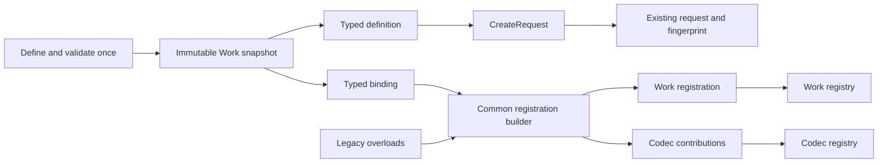

# Design: Immutable typed Durable Work definitions

Generated by `/office-hours` on 2026-09-10

Repository: `forge-trust/AppSurface`

Issue: [#800](https://github.com/forge-trust/AppSurface/issues/800)

Parent: [Executable-contract adoption rail #793](https://github.com/forge-trust/AppSurface/issues/793)

Branch at design time: `main`

Implementation baseline: `48c6db61ac5f742bea9f1ee434860daf72df791c` (`origin/main`, includes Work exits)

Status: APPROVED

Mode: Builder

Lineage: refines Case 2 of the approved September 6 adoption-rail design; preserves its other cases. Supersedes `andrew-main-design-20260813-030314-issue235-multiple-docs-instances.md` for office-hours branch discovery only; the Docs product decision remains independent.

## Problem and intended outcome

Registration and request creation repeat Work name, version, codec, provider safety, and retry defaults. A nine-argument request constructor lets an adopter accidentally disagree with registration. The runtime rejects mismatches, but the supported authoring path should prevent them.

The [parent's adopter evidence](https://github.com/forge-trust/AppSurface/issues/793) identifies repetition across seven worker lanes. Its registration sketch grew from six to ten lines; line count is secondary to removing repeated facts and retaining explicit application decisions. Real time to first durable completion was not measured by that evidence.

The useful result is one static typed definition that feeds registration and request construction. Call sites still declare scope, command, duplicate-submission key, payload, due time, and any intentional retry override. The definition performs no storage, execution, or host activation.

## Decisions and boundaries

- **Approved D1:** measure consistent contract facts and equivalent accepted requests, preserve the published binding matrix and legacy APIs, and freeze codec metadata while documenting the codec author's concurrency obligations.
- **Approved D3, approach B:** introduce one internal immutable contract snapshot consumed by definitions, bindings, registrations, and registry contributions. This makes validation and compatibility rules reusable by later adoption-rail cases.
- **Rejected approach A:** definition-owned adapters as the primary model would require more independent identity rules; thin codec views remain compatibility projections of the shared snapshot, not another authoritative model.
- Reuse the existing [Work request and retry contracts](../../Durable/ForgeTrust.AppSurface.Durable/DurableWorkContracts.cs), [registration machinery](../../Durable/ForgeTrust.AppSurface.Durable/DurableWorkRegistration.cs), and [Work protocol](../../Durable/work-protocol-v1.md). Preserve accepted fingerprints and storage semantics.
- [Work exits #783](https://github.com/forge-trust/AppSurface/issues/783) landed in [#792](https://github.com/forge-trust/AppSurface/pull/792). Implement against that final contract. The design checkout is eight commits behind the baseline and must be brought onto the implementation baseline in a separate implementation task.
- No assembly scanning, reflection-based discovery, global registry/cache, expression-tree identity, implicit runtime-type serializer, new package, database migration, worker host, HTTP adapter, deadline, or persisted attempt plan. [#765](https://github.com/forge-trust/AppSurface/issues/765) and the parent's other child cases retain their ownership.

## Public API

Add the following types to [ForgeTrust.AppSurface.Durable](../../Durable/ForgeTrust.AppSurface.Durable/README.md):

| Type | Public purpose |
| --- | --- |
| `DurableWork` | Static generic `Define<TWork, TResult>` factory; no mutable static state. |
| `DurableWorkDefinition<TWork, TResult>` | Sealed immutable owner of one validated Work contract and its request default. |
| `DurableWorkBinding<TWork, TResult, TExecutor>` | Immutable ordinary executor binding, with an optional next step to bind a reconciler. |
| `DurableReconciledWorkBinding<TWork, TResult, TExecutor, TReconciler>` | Complete reconcile-before-retry binding. |
| `DurableExitWorkBinding<TWork, TResult, TExecutor>` | Complete ProviderKeyed exit-aware binding. |

Definition and binding constructors are internal. The factory and binding methods are the supported construction paths. Use get-only properties and no `init`, setters, mutable options builder, or public copy operation that bypasses validation.

The factory takes `workName`, `workVersion`, `IDurablePayloadCodec<TWork> workCodec`, `IDurablePayloadCodec<TResult> resultCodec`, `DurableProviderSafety providerSafety`, and a required non-null `DurableWorkRetryPolicy defaultRetryPolicy`. Requiring the default explicitly matches the issue example; `DurableWorkRetryPolicy.Default` is the ordinary choice.

The definition exposes `WorkName`, `WorkVersion`, `ContractIdentity` (the existing `DurableWorkContractIdentity`), typed `WorkCodec` and `ResultCodec`, `ProviderSafety`, and `DefaultRetryPolicy`. Its typed codec properties are stable, guarded views of its captured codec snapshots. Each binding exposes its exact `Definition` instance; it accepts no repeated identity, codec, or policy facts.

```csharp
public static readonly DurableWorkDefinition<SendInvoice, SendInvoiceResult> Definition =
    DurableWork.Define(
        workName: "billing.send-invoice",
        workVersion: "v1",
        workCodec: SendInvoiceCodec.Instance,
        resultCodec: SendInvoiceResultCodec.Instance,
        providerSafety: DurableProviderSafety.ProviderKeyed,
        defaultRetryPolicy: DurableWorkRetryPolicy.Default);

services.AddDurableWork(Definition.ExecutedBy<SendInvoiceExecutor>());

var request = Definition.CreateRequest(
    scopeId, commandId, idempotencyKey, new SendInvoice(invoiceId),
    dueAtUtc: null);
```

This is an API sketch, not an independently runnable example. The implementation must put equivalent complete, compiled examples in the packed adopter fixture and reference them from documentation.

Preserve the issue's exact request-factory argument order and defaults:

```csharp
DurableWorkRequest CreateRequest(
    DurableScopeId scopeId,
    DurableCommandId commandId,
    string idempotencyKey,
    TWork work,
    DurableWorkRetryPolicy? retryPolicy = null,
    DateTimeOffset? dueAtUtc = null);
```

The generic methods and extension overloads remain:

```text
Definition.ExecutedBy<TExecutor>()
  -> DurableWorkBinding<TWork, TResult, TExecutor>
  where TExecutor : class, IDurableWorkerExecutor<TWork, TResult>

Binding.ReconciledBy<TReconciler>()
  -> DurableReconciledWorkBinding<TWork, TResult, TExecutor, TReconciler>
  where TReconciler : class, IDurableEffectReconciler<TWork, TResult>

Definition.ExecutedByExit<TExecutor>()
  -> DurableExitWorkBinding<TWork, TResult, TExecutor>
  where TExecutor : class, IDurableWorkExitExecutor<TWork, TResult>

services.AddDurableWork(ordinaryBinding)
services.AddDurableWork(reconciledBinding)
services.AddDurableWork(exitBinding)
```

Extension methods retain the corresponding generic constraints and return the same `IServiceCollection`. Bindings carry generic type information so callers need not repeat type arguments. There is no `ReconciledBy` on the exit binding.

## One shared internal contract

Use an internal typed Work snapshot containing the validated Work identity, provider safety, default retry policy, and two typed codec snapshots. A codec snapshot contains its original codec reference plus `PayloadType`, contract name, contract version, classification, and retention-policy identifier. Keep the callable reference and immutable metadata distinct.



Bindings pass the snapshot itself to the builder. New internal registration constructors take that snapshot; they do not reconstruct it from the definition's properties. The existing public registration constructors and legacy extension overloads close their supplied facts once through the same validation/building helpers, with the existing default retry policy used only as an internal construction default. Registration does not make that default a rule for already accepted requests.

Thin internal codec views implement the existing typed/untyped codec interfaces over a snapshot. Metadata getters read captured values. Invocation delegates to the original codec. Views neither own a second serializer nor capture metadata again. No global interning is needed: snapshots belong to definitions, registrations, and individual service providers.

### Construction and codec checks

Validate Work identifiers using the existing bounds (name 200, version 100), a defined provider-safety enum, non-null codecs and retry default, and exact generic payload type equality. Capture each supplied codec's metadata getters once per unique codec reference in a closure operation. If Work and result use the same source instance, reuse that codec snapshot when the generic types permit it.

Validate each codec independently: contract name at most 200, version at most 100, a defined `DurableDataClassification`, and retention-policy identifier at most 128, using the existing identifier rules. Work identity and input/result codec identities are separate namespaces. Distinct valid names and versions across all three are explicitly supported.

Argument failures use the existing argument-exception conventions; a throwing custom metadata getter propagates its original exception. Neither construction nor binding invokes `Encode`, `Decode`, an executor, a reconciler, a service provider, or a database.

Every guarded `Encode`/`EncodeObject` checks non-null output and exact equality of encoded contract name, version, classification, and retention against the captured codec snapshot. Return the original immutable `DurableEncodedPayload` unchanged. Never relabel bytes to make an incompatible codec appear correct. A mismatch throws `InvalidOperationException` with a bounded contract-mismatch explanation, without payload bytes or arbitrary codec output.

Every guarded `Decode`/`DecodeObject` checks the same payload metadata before invoking the original codec, then rejects a null or wrong-type untyped result. Codec policy, serialization, and size-limit failures retain their existing exception behavior. `DurableEncodedPayload` remains responsible for the protocol byte bound, byte copy, and content hash.

The definition does not promise that arbitrary custom codec code is immutable or thread-safe. Codec metadata getters must be stable during initial capture; concurrent mutation between getter calls is unsupported, and the framework cannot prove a coherent multi-getter read from an arbitrary consumer object. Codec implementations, approval predicates, and captured dependencies must be safe for concurrent use and preserve their contract behavior. A later metadata getter mutation cannot change a captured snapshot; later incompatible output is rejected. Metadata getter changes alone are not polled or necessarily detected, and changed decoding behavior or mutable application state cannot be frozen by this API. There is no hidden lock around consumer code and no runtime mutation of a static definition.

### Request construction and accepted Work

1. Validate scope, command, duplicate-submission key, and non-null Work input before calling a codec, using the existing validators.
2. Encode once through the captured Work codec view.
3. Resolve `retryPolicy ?? DefaultRetryPolicy` and call the existing `DurableWorkRequest` constructor with the exact captured Work name, version, safety, encoded payload, and due time.

The existing constructor normalizes due time to UTC and computes the existing `appsurface.durable.work.enqueue.v1` fingerprint. Do not add result codec metadata, binding type, executor type, or definition-object identity to that fingerprint. Equivalent direct and factory requests must have exactly equal fingerprint `SchemaId` and `Sha256` strings; no separate fingerprint serialization is introduced. Compare Work name/version, provider safety, payload metadata/content bytes/content hash, every retry-policy field, and normalized due time separately as well. An explicit override changes the fingerprint exactly as direct construction does today.

Changing a definition default affects only future requests made with that different definition. The request already contains immutable payload bytes, safety, retry values, due time, and fingerprint. Nothing in this feature rewrites accepted records or changes retry/execution authority. A deployment with changed executor semantics, codec semantics, or binding style must use the existing Work-version rollout discipline; replacing an executor style for historical Work is not a migration shortcut.

## Bindings and validation timing

| Operation | Accepted safety classes | Failure boundary |
| --- | --- | --- |
| `ExecutedBy<TExecutor>()` | All defined values | Generic constraint at compile time; returns an intermediate value even for `ReconcileBeforeRetry`. |
| Ordinary `AddDurableWork(binding)` | Idempotent, ProviderKeyed, ManualResolution | Reject incomplete `ReconcileBeforeRetry` binding before adding descriptors. |
| `ReconciledBy<TReconciler>()` | ReconcileBeforeRetry only | Reject other safety classes immediately, before any DI mutation. |
| Reconciled `AddDurableWork(binding)` | ReconcileBeforeRetry | Complete binding validated before descriptors are added. |
| `ExecutedByExit<TExecutor>()` | ProviderKeyed only | Reject other safety classes immediately. No reconciler method exists. |
| Any duplicate `(WorkName, WorkVersion)` | None | Work registry construction rejects it, regardless of binding style or object identity. |

Null services/bindings throw `ArgumentNullException`. Bindings are sealed and internally constructed; callers cannot substitute the wrong definition after binding. All pure validation precedes service-collection mutation. Do not claim transactional rollback for a custom `IServiceCollection` implementation that throws while adding descriptors.

The existing ordinary executor, reconciler, prepared-work, and exit-aware invocation contracts remain authoritative. Preserve the legacy success-to-exit adapter and the fail-closed exception for a non-success exit invoked through the legacy success-only provider boundary. Do not invent another exit type or change effect-permit ordering.

## Codec identity and registry compatibility

The [current registry](../../Durable/ForgeTrust.AppSurface.Durable/DurablePayload.cs) permits registering the same codec object repeatedly but rejects different codec objects for the same codec name/version. Keep that distinction. Metadata equality alone never proves two serializers are interchangeable.

Give internal snapshot views unforgeable provenance through an internal implementation type: the exact original codec reference and full captured metadata. Do not allow consumer-provided marker interfaces to assert equivalence.

| Codec contribution pair | Result |
| --- | --- |
| Same original source object, same complete snapshot | Coalesce the codec contribution; distinct Work identities remain distinct registrations. |
| Same original source object, different captured metadata | Reject a codec-contract conflict. Never select by registration order. |
| Different source objects, same codec name/version | Preserve the duplicate-codec exception, even if all metadata matches. |
| Different valid codec identities for the same CLR type | Allow exact identity lookup; preserve the ambiguous type-only lookup exception. |
| Same Work identity registered twice | Always reject at the Work registry boundary; codec coalescing does not coalesce Work. |

The internal `DurableCodecContribution` carries original source reference, captured metadata, a typed view factory that never rereads the source, and whether the public path requires a frozen projection. Work registration contributes these values separately from the existing public `IDurablePayloadCodec` descriptors. Definition contributions require a frozen projection; legacy contributions retain raw-reference compatibility. Codec registry entries store metadata for indexing and type checks rather than using returned codec getters.

The default factory uses one internal contribution aggregator, before insertion into registry dictionaries:

1. Read the already-validated Work contribution snapshots. Index by original source reference, retaining every supplied snapshot long enough to reject conflicting snapshots of that same source. Do not choose the first snapshot and discard the others.
2. Read the public codec descriptors. For a known source or its package-owned view, consume the captured metadata without calling the original getters. For an unknown raw source, capture its metadata once in this registry construction. Repeated raw descriptors of that source reuse the capture. A separately supplied package view contributes its own stored snapshot and participates in conflict checks.
3. Reject same-source/different-snapshot contributions first. Group the remaining entries by exact codec name/version; reject different sources claiming that identity. Populate the type index from captured `PayloadType`, retaining distinct contract versions.
4. If any contribution in a group requires a frozen projection, create one **registry-owned canonical view** from its verified source and metadata. Do not select one of the definitions' view objects. This removes a reference-identity winner based on DI order. If all contributions are legacy/raw, return the original raw source as today.
5. Build the lookup dictionaries from this complete validated set. No partially constructed registry escapes after a conflict. Multiple conflicting groups are reported in ordinal contract-name/version order; source-object hashes are not diagnostic identities.

The same internal provenance comparison is used by later public `Register` calls when a package-owned view is involved; registering an equivalent raw source or equivalent view is idempotent. Raw-only public registration preserves its existing reference equality behavior. A first frozen contribution can upgrade a raw-only registry entry to a canonical frozen view without changing contract facts; later raw additions cannot downgrade it. Manual registrations are sequential, so callers retaining a raw reference from before such an upgrade keep that reference; built-in DI always aggregates before exposing the registry.

For new definition paths, registration `WorkCodec`/`ResultCodec` properties expose the definition's exact typed snapshot views. The codec registry's canonical view is a different object with the same source and complete metadata. Do not use view reference equality to discover Work identity. Each service provider builds its own canonical registry view, while a static definition's own views can be shared across providers.

Keep `InvalidOperationException` and the existing text for different-source/same-contract duplicates. For same-source/different-snapshot conflict use `InvalidOperationException` with the bounded message `A durable payload codec source was contributed with conflicting contract metadata.` Do not interpolate either metadata snapshot. Duplicate Work validation precedes codec aggregation; within codec aggregation source-snapshot conflict precedes contract collision. These are construction exceptions, not new `ASDURxxx` outcomes.

Legacy public registration constructors and extension overloads preserve their original codec-reference properties for valid existing callers; their internal invocation can use captured views. New definition-based registrations expose guarded views through the existing public codec interfaces so providers benefit without a new provider SPI. Existing consumers must still treat raw custom codec mutation as unsupported.

### Flow compatibility

[Flow activity binding](../../Durable/ForgeTrust.AppSurface.Durable/DurableFlowRegistration.cs) currently requires the exact codec object held by its registration. Keep exact source-object identity as a requirement. Extend the internal comparison only for package-owned snapshot views: accept the registration-owned view, its exact raw source, or another package-owned view of that same source with equal complete metadata. Reject unrelated codecs with matching metadata and reject views with different snapshots.

After validation, a definition-based Flow activity binding stores the registration-owned guarded typed codecs for activity encoding, result decoding, and result expectations, even when the caller supplied the raw source. Never validate a view and then execute an unchecked raw codec.

No public Flow constructor, overload, or conversion helper is added in #800. Use the existing `DurableFlowActivityBinding<TContext,TWork,TResult>(callsite, workRegistration, workCodec, resultCodec)` constructor. When composing a Flow around a definition, an existing `AddSingleton<DurableFlowRegistration>(provider => ...)` factory resolves the exact global Work registration by the definition's Work name/version and passes `Definition.WorkCodec`/`ResultCodec` to that constructor. Register the Flow's context/event codecs and passive registries using the existing low-level DI surface; provide one compiled composition example. Do not build a nested service provider or manufacture a second Work registration. The existing eager `AddDurableFlow` convenience API is unchanged.

Use the same internal provenance comparison at all codec-reference compatibility checks in `DurableFlowRegistry` (context and event codecs), `DurableFlowRegistration.EvaluateAsync` (wait-event codec), and the activity-binding constructor. **Keep the exact Work-registration reference check unchanged**: source equivalence applies only to codec views, not Work registrations. Activity result expectations read the guarded Work registration's result codec.

`DurableFlowRegistration.ContextCodec` and event-binding codec properties retain their immutable registration-owned references. At the start of each evaluation, resolve the context codec from the supplied registry using exact payload type/name/version, verify its provenance against the stored context codec, and retain the resolved codec in a local variable for both context decoding and context encoding in that evaluation. Use its untyped `DecodeObject`/`EncodeObject` interface with an explicit result-type check so a compatible custom registry need not expose the typed codec interface. Apply the same local resolution/provenance rule to event codec selection and wait-event metadata; resume-event decoding uses that selected registry codec. A raw source is executed only when the selected registry returns that exact raw source. A failed lookup or incompatible source fails closed, without a fallback to the stored codec. No registration mutation or cached replacement occurs. This local context/event selection does not replace an activity binding's registration-owned guarded Work/result codecs.

Prove that a codec shared between Work and a Flow context/event survives registration and wait/resume evaluation in either registration order, including context encoding, activity result decoding, and event-resume decoding. Keep Flow definition fingerprint fields and canonicalization unchanged. Raw-only Flow reference behavior and two historical codec versions sharing a CLR type remain covered. These changes address shared-codec compatibility only; there is no new Flow-definition model.

### DI composition and duplicate precedence

Use one internal registry-installation helper from the [passive module](../../Durable/ForgeTrust.AppSurface.Durable/AppSurfaceDurableModule.cs), Work helpers, and Flow helpers. It uses `TryAddSingleton` for an internal `DurableWorkRegistrationCatalog`, the default `IDurableWorkRegistry` factory, and the default `IDurablePayloadCodecRegistry` factory. It never removes/reorders consumer descriptors. Contributions and registration values are explicit singleton descriptors.

The catalog materializes `IEnumerable<DurableWorkRegistration>` and validates exact Work identities with the existing duplicate diagnostic. Its map/list are immutable. Direct public `DurableWorkRegistry(IEnumerable<...>)` construction uses the same internal validation routine; the default factory may reuse the catalog's already validated map. The default codec factory **resolves this catalog before resolving codec-contribution or raw-codec enumerables**, then runs the aggregator above. Thus an unrelated codec conflict cannot mask a duplicate Work identity.

The dependency graph is acyclic: default Work registry -> catalog -> registration values; default codec registry -> catalog, captured codec contributions, public codec descriptors; Flow registry -> selected Work and codec registries. The codec factory does not resolve the public `IDurableWorkRegistry` and does not assume that a custom registry enumerates its registrations.

| Composition order | Selected descriptors and behavior |
| --- | --- |
| Module before/after Work or Flow helpers | One default descriptor per public registry and one catalog descriptor; helpers add only their contribution values. |
| Consumer registry before any package helper | `TryAddSingleton` leaves that service's descriptor alone. |
| Consumer registry appended after a package default | Normal DI last-registration selection applies; later package helper calls add no new default. Existing enumerable-service behavior is not rewritten. |
| Custom Work registry with default codec registry | The default codec registry validates the local package registration catalog, then aggregates codecs; it neither calls nor validates the custom registry's private contents. |
| Custom codec registry with default Work registry | Work identity validation stays in the default catalog/registry; the custom codec registry owns its codec behavior. |
| Both public registries custom | No package validation of custom private state is promised; unused internal catalog is not eagerly constructed. |

Consumer overrides own their semantics, including any additional dependencies; no cycle is added by the default codec factory through a custom Work registry. Assert selected descriptor identity/count and successful resolution, not only final registry contents. Include duplicate Work plus an unrelated codec conflict in both contribution orders and prove the Work exception wins when the default codec registry is resolved first.

| Object | Identity/lifetime scope |
| --- | --- |
| Definition, its snapshot, its typed codec views | Created once by `Define`; the exact objects are reused if the static definition enters multiple providers. |
| Binding | Each binding-method call returns an immutable value object; the exact supplied instance is registered as singleton. |
| Original codec | Caller-owned source instance, often static; never cloned, disposed, or replaced by a view. |
| Work registration and legacy closure | Created once per registration contribution, stored as singleton values; building two providers from the same service descriptors can share these immutable values. |
| Catalog, default registries, canonical registry codec views | Created once per service provider; no state is written back into definitions or bindings. |
| Executor/reconciler | Transient resolution through the existing invocation boundary; not captured by a definition or registration. |

Registration resolves neither executor nor reconciler and does not start a hosted service.

Register exact definition/binding instances as singleton descriptors. When multiple Work definitions share the same closed generic type, use their captured object references and Work registry identities. `IEnumerable<DurableWorkDefinition<TWork,TResult>>` can enumerate them. Do not resolve a single generic definition to select a contract: ordinary DI last-registration behavior is not a Work-selection API. Registering the same definition/binding twice still contributes duplicate Work registrations and must fail.

## Verification and acceptance evidence

Tests are requirements for implementation, not checks claimed to have run during this design session. Reuse the existing [contract tests](../../Durable/ForgeTrust.AppSurface.Durable.Tests/DurableContractTests.cs), [fingerprint tests](../../Durable/ForgeTrust.AppSurface.Durable.Tests/DurableCommandFingerprintTests.cs), [PostgreSQL Work-store tests](../../Durable/ForgeTrust.AppSurface.Durable.PostgreSql.Tests/PostgreSqlDurableWorkStoreTests.cs), and the baseline's `DurableWorkExitTests.cs`.

| Proof | Required cases |
| --- | --- |
| Definition validation | Nulls, whitespace/control/oversized identifiers, exact limits, undefined safety/classification, wrong Work and result `PayloadType`, invalid metadata getter values, getter exceptions, explicit non-null retry default. |
| Capture stability | Each metadata getter read once per unique source in closure; no recapture during binding/registration/registry contribution; Work and result identities may differ from each other and Work identity. |
| Codec boundary | Encode once; policy/serializer exception; null output; each mismatched metadata field; incompatible decode input rejected before custom decode; null/wrong-type untyped decode result. |
| Requests | Direct/factory fingerprint parity, custom default versus library default, explicit override, due time and UTC equivalence, invalid request identity before encoding, immutable bytes, concurrent request creation without cross-talk. |
| Binding matrix | All safety rows, missing reconciler, wrong reconciler safety, exit-only ProviderKeyed, no state mutation after a failed bind/register call. |
| Identity | Shared source across distinct Works and providers; same source with differing snapshot; different sources claiming same codec identity; duplicate identical Work; mixed legacy/ordinary/reconciled/exit duplicates in both orders. |
| Lifetimes/composition | Singleton definitions/bindings/registrations/views/registries; transient executors/reconcilers; no eager construction or hosted service; multiple definitions with same generic types; default/custom registries; module/Flow/Work ordering. |
| Invocation | Exact typed payload/result propagation, execution identity/fence preservation, reconciler outcomes, all landed exit cases, conservative legacy provider boundary. |
| Flow | Existing raw reference assertions, new views, exact-source equivalence, rejection of unrelated equal-looking codecs, use of guarded view after validating raw source, result expectation stability. |
| Accepted-state integration | Enqueue factory request against PostgreSQL, compare direct replay as Duplicate; conflicting policy/payload yields existing conflict behavior; a different definition/default cannot alter the accepted policy/payload/fingerprint; rollback remains atomic. |

Add focused definition/binding test files rather than further expanding the monolithic contract test class. Use ordinary test doubles and intentional internal seams, not reflection. Keep PostgreSQL tests bounded and reuse the existing disposable database fixture and runtime-role configuration.

Extend [the packed-consumer proof](../../Durable/verify-packed-consumers.sh) using its isolated local NuGet feed and temporary directories. Compile valid terse syntax for all three binding styles, differing codec identities, and unchanged legacy syntax against the produced package. Retain its existing runnable adopter/provider proofs; do not replace them with compile-only checks.

Add compile-negative disposable fixtures for wrong ordinary executor Work/result types, wrong reconciler types, wrong exit executor types, a non-class implementation against the class constraint, and attempting a reconciler on an exit binding. Put `// expected-compiler-error: CS0311` on the deliberately invalid statement for incompatible interface constraints; use `CS0452` for the non-class constraint and `CS1061` for the missing exit-binding member. Keep one intentional invalid statement per fixture. Restore each fixture successfully first, then build with `--no-restore` and capture structured compiler diagnostics. Require a nonzero compile exit, at least one allowed diagnostic at that exact marked source line, and no unexpected error diagnostics anywhere. If a compiler version legitimately emits an additional diagnostic, document a fixture-specific exact allowlist with a positive control; do not broadly accept a diagnostic family or arbitrary failure. Missing packages, restore failure, infrastructure failure, or errors only elsewhere must fail the harness. Compile the corresponding valid statement against the same local package feed as a positive control.

Run formatting, affected analyzer/API-baseline checks, focused Durable and PostgreSQL tests, the packed proof, and [solution coverage](../../scripts/coverage-solution.sh) when practical. Aim for nearly complete changed-branch verification, including guards and failure paths. The packed proof already runs in [build CI](../../.github/workflows/build.yml) and [coverage-efficiency CI](../../.github/workflows/coverage-efficiency.yml); extend that script so these invocations execute the new positive/negative fixtures as well.

### Issue #800 traceability

| Issue obligation | Design/proof location |
| --- | --- |
| Own Work facts once; retain per-request choices | Public API and request construction; direct/factory field equality and fingerprint proof. |
| Validate both codecs independently and snapshot once | Construction/codec checks and aggregator capture algorithm; getter-count, distinct-namespace, bad-metadata tests. |
| All three binding forms and generic constraints | Public API and binding matrix; runtime safety matrix plus packed negative fixtures. |
| Singleton contracts and transient implementations | Lifetime table; same-definition/two-provider and same-generic-type DI tests. |
| Duplicate and mixed binding failures | Catalog and codec conflict precedence; duplicate Work plus unrelated codec-conflict test. |
| Legacy registration/request/exit compatibility | Shared builder, preserved raw properties, Flow integration and landed exit proofs; packed old/new syntax. |
| Codec failure, explicit retry override, due time, concurrency | Codec boundary, request tests and accepted-state PostgreSQL proof. |
| Accepted Work cannot change silently | Immutable request fields, unchanged fingerprint algorithm, replay/conflict and stored-policy assertions. |
| XML, protocol, README, diagnostics, API baseline, versioned migration | Documentation/distribution section and implementation sequence; migration examples compiled from package consumers. |
| No reflection/discovery/new execution authority | Decisions/boundaries and shared-snapshot model; review public API additions and dependencies. |

## Documentation and distribution

Update XML reference/remarks/exception documentation for every affected public and internal API, including snapshot/view/provenance helpers and registry construction. Explain defaults, validation timing, thread safety, codec identity, static reuse, lifetime, and when direct request construction is appropriate.

Update the [package README](../../Durable/ForgeTrust.AppSurface.Durable/README.md), [Durable overview](../../Durable/README.md), [Work protocol](../../Durable/work-protocol-v1.md), [diagnostics catalog](../../troubleshooting/durable-diagnostics.md), [public API baseline](../../Durable/ForgeTrust.AppSurface.Durable/PublicAPI.Shipped.txt), and [API budget](../../Durable/api-budget.md). Add a nearby migration link from the [package chooser](../../packages/README.md) and root Durable entry when useful for adoption.

Create `Durable/migrations/typed-work-definitions-v1.md` during implementation. It is versioned guidance for the public-preview API rail, not a SQL migration or an invented release number. Show complete old/new registration and request examples for ordinary, reconciled, and exit-aware Work; keep scope, command, duplicate-submission key, payload, due time, and retry choices visible. Explain duplicate/mixed binding errors, same-type versioned codecs, raw versus frozen codec views, and replacing rather than double-registering a migrated contract. Legacy overloads remain available and are not obsolete. No codemod is promised: codec, safety, request identity, and duplicate-submission policy cannot be inferred safely.

Document construction errors separately from provider `ASDURxxx` outcomes; retain existing Work/codec duplicate messages and existing acceptance-conflict semantics. Do not allocate new provider problem codes merely for argument validation. Error text must not include payload bytes, scope/command keys, or arbitrary codec values.

Ship the API in the existing `ForgeTrust.AppSurface.Durable` NuGet package using the repository's [coordinated release process](../../releases/README.md), [package gate](../../.github/workflows/package-gate.yml), and [prerelease publishing workflow](../../.github/workflows/nuget-prerelease-publish.yml). Add a release-note fragment linking #800. There is no new artifact, distribution channel, runtime dependency, or database rollout.

## Implementation sequence and assignment

1. Begin on the baseline containing #783. Implement the shared snapshot/codec validation and request factory, with fingerprint parity and mutable-codec failure proofs first.
2. Add the three typed binding forms and common builder. Preserve legacy signatures, reference compatibility, passive composition, and duplicate precedence.
3. Integrate snapshot-aware codec contributions and Flow source/view handling. Prove shared-codec, same-generic-type, ordering, and custom-registry cases.
4. Add packed positive/negative proofs and the accepted-state PostgreSQL proof. Finish XML, migration, protocol, diagnostic, API-baseline, and release documentation together.

**Assignment:** take the representative billing-lifecycle registration and one enqueue call from the parent's pinned adopter evidence. Write old/new snippets against the final package API, mark each formerly duplicated fact, and confirm that every remaining scope, command, duplicate-submission, retry-override, and due-time decision is still visible. Then run the direct-versus-definition accepted-request proof. Report contract duplication removed and behavior preserved; do not claim an unmeasured cold-start improvement.

No product-scope questions remain after D1/D3. Implementation review must verify the registry factory's metadata-capture and duplicate-precedence invariants before code is accepted. The optional pre-alternatives second opinion was declined; the finished design receives a separate adversarial specification review.

## Session decisions

- You approved the distinction between frozen contract facts and the custom codec author's concurrency obligations.
- You chose **B**, the shared snapshot, accepting the additional compatibility work in exchange for one internal source of truth.
- You approved the reviewed design on 2026-09-10.
- This session produced a design only. Code, package publication, issue updates, and provider execution are separate work.

## Specification review

Three adversarial review rounds completed. The first identified 14 actionable clarifications; the second confirmed those fixes and requested one final Flow evaluation rule. All 15 were addressed. The final reviewer returned PASS and a subjective quality score of 10/10, with no residual concerns. This assesses the design, not an implementation.

All 24 relative repository links were verified against the pinned implementation baseline. No implementation tests were run in this design session. Final document approval was received on 2026-09-10.
